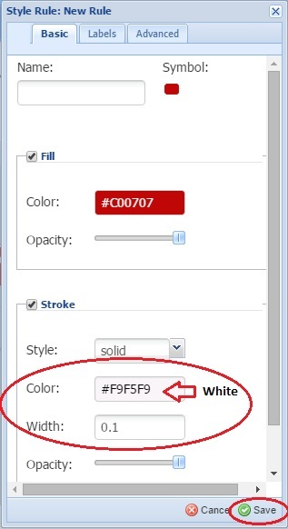
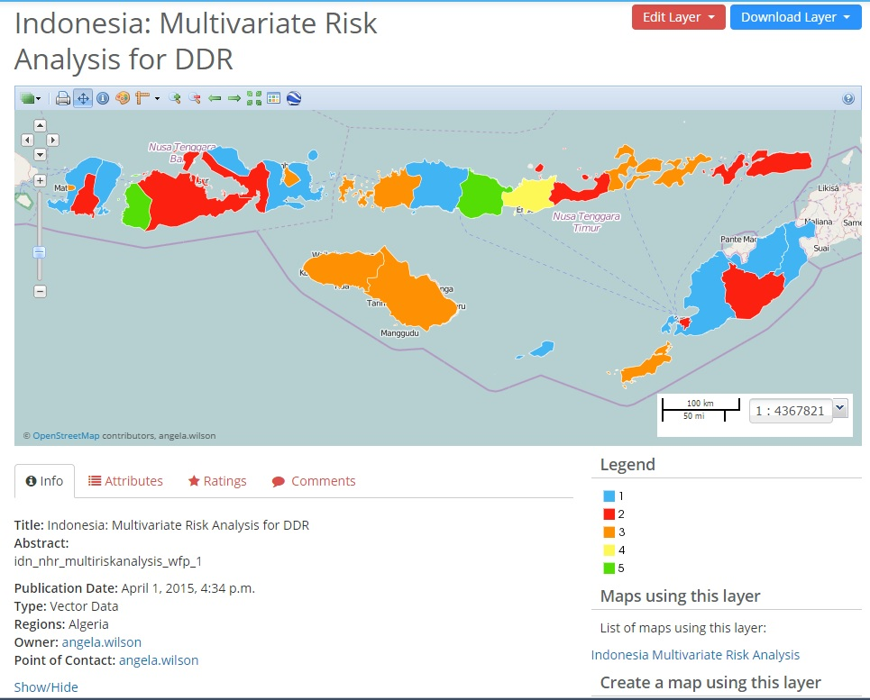

.. _advanced_user_module:

====================
Advanced User Module
====================

Module Objectives
==================

Upon completion of the Advanced User Module, the participant is expected to be able to:
 
• Understand how to manage user accounts, including set up, log in and creating profiles;
• Upload data layers and documents correctly;
• Understand and apply crucial practice for setting permissions, editing metadata and using naming conventions;
• Style layers appropriately in order to create explanatory appearances;
• Produce illustrative maps in WFPGeoNode;
• Edit data in layers and understand the consequences of such procedures;
• Identify his/her own information gaps when producing a GIS-product in WFPGeoNode.

Advanced Level
==============

The following sections explain how to manage a user account and profile; how to upload layers using correct file formats and procedures; how to style a layer using color symbolization by creating rules and conditions; and how to easily modify data directly in the layer. As in the previous module, the sections are focused on either a specific interface, or on specific functions.

Register a New Account
,,,,,,,,,,,,,,,,,,,,,,

The WFPGeoNode platform supports an authorization system that gives you granular control over access
of all uploaded and published information. Since most advanced features in WFPGeoNode are only open
for registered users, a user account needs to be activated. To request a user account, send an email to
omep.gis@wfp.org where you explain how you intend to use WFPGeoNode. Once your request has been
processed you will receive an email with instructions on how to proceed with the registration.

Sign in and Create a Profile
,,,,,,,,,,,,,,,,,,,,,,,,,,,,,

As soon as your user account is activated you can log in to WFPGeoNode by using **Sign in** in the top-right corner on the homepage (*Figure 25*).

.. image:: img/Sign_in_drop_down_box.jpg
*Figure 25: Sign in drop-down box*

It is useful to update your profile once you are signed in, since the information you provide here can be of great added value to other users. It allows the WFPGeoNode community to view details on for example location, job position, and previous activities of a specific user. Since all layers and maps are closely associated with the user uploading or creating them, a comprehensive profile quickly allows you to understand the context in which they were created. Once you are signed in you can access your profile by clicking on your name in the top-right corner and using **Profile** (*Figure 26*).

*Figure 26: Profile drop-down box*

In the profile interface you can view detailed information about your user account, as well as **Edit Profile Information**, manage **Account Settings** and **Change Password**. All layers/maps/ documents that have been uploaded and created by the specific user are visible in the content list under **Resources**
(*Figure 27*).

*Figure 27: Profile interface showing content created by the user*

Use **Edit Profile Information** to manage information on e.g. your organization, location, job description and contact details, and to upload your picture (*Figure 28*).

*Figure 28: Edit profile information*

Permissions
,,,,,,,,,,,

**Permissions** determine who can view, download, edit and manage layers and maps. It is important to understand the differences between these settings since neglecting specifying permissions can result in giving unintentional access to layers/maps. The following settings are available:

**Who can view and download this data?**

• **Anyone**: allows anyone to access the data, including unregistered users.
• **Any registered users**: only users with a WFPGeoNode account can access data.
• **Only users who can edit**: limits access to users specified in below setting.

**Who can edit this data?**

• **Any registered users**: allows any user to edit, replace or remove your data.
• **Only the following users**: limits editing rights to the users you specify (in addition to the owner of the layer/map).

**Who can manage and edit this data?**

• Limits managing permissions to specified users. They become the only users able to set the permissions of the layer/map. The user uploading a layer is by default the owner of that layer with full managing permissions.

To ensure correct permissions are selected, adjust them before uploading new layers or creating maps (*Figure 29*). You can change these settings later in the Layer View and Map View interfaces, by using the red **Edit Layer/Edit Map** button and **Edit (Map) Permissions**.

*Figure 29: Setting Permissions*

.. TIP::
	Ensure permissions for editing reflect your intentions by selecting “Only the following users” if you do not want anyone else to be able to remove your data.	

Naming Conventions
,,,,,,,,,,,,,,,,,,,

Before uploading layers to WFPGeoNode, you need to rename the files according to the common naming conventions. This practice ensures that just one comprehensive and easy to follow standard is respected throughout the system. In brief, the naming convention for baseline data is:

• iso3_class_description_(source)_(date yyyymmdd)

Following this logic, a shapefile (comprising of four individual files) representing Indonesian administrative boundaries level 1, containing data originating from the government should be named:

• idn_bnd_adm1_gov.shp
• idn_bnd_adm1_gov.shx
• idn_bnd_adm1_gov.dbf
• idn_bnd_adm1_gov.prj

The part of the name with the description must not contain an underscore even if the description is more than one word. In addition, only lower case is allowed and the total length of the name cannot supersede 40 letters. Further detailed description of the files should instead be provided as metadata after the upload.

The naming convention for static maps is:

• iso3_class_description_format_date

Following this, a map containing security levels prefectures for Central African Republic in A3 landscapeformat which has been produced on 08 May 2014, should be named:

• CAF_SEC_PrefecturesSecurityLevel_A3L_20140508

More in-depth information on naming conventions can be found in Annex 2. To request a list of the most recent naming conventions, contact omep.gis@wfp.org.

.. TIP::
	The naming conventions apply to data files such as Shapefiles and GeoTIFF, which is different from providing a title for the data layer. Data files need to be named correctly before being uploaded to WFPGeoNode, whereas the title of the data layer is provided as metadata after the layer is uploaded and can be modified multiple times.

Upload Data Layers
,,,,,,,,,,,,,,,,,,,

In WFPGeoNode it is possible to upload your own data to the system, allowing you to create raster and vector layers that can be shared or used to create maps.

There are two main ways to start uploading data:

• On the Homepage by using Upload Data
• On the Explore Layers interface by using Upload Layers
Following either of these procedures the Upload Layers interface will appear (*Figure 30*).
 

.. image:: img/Upload_layer_interface.jpg
*Figure 30: Upload layer interface*

.. TIP::
	WFPGeoNode supports uploading of vector layers in Shapefile format (comprised of four files with the extensions: .shp, .prj, .shx, .dbf) and raster layers in GeoTIFF format. The system also supports optional pre-defined visulatization styles in SLD format for both layers formats, as well as pre-defined metadata in XML format for raster layers (see Annex 1 for online resources on how to create SLD files).

To select the data you would like to upload, simply drag-and-drop your files onto the gray area, or use **Browse** and select the files from your file system. The files will appear below the drag-and-drop area, and the system will automatically specify the file format as Shapefiles or GeoTIFF (*Figure 31*). In case a required file is missing (for shapefiles) you will be requested to add the file before you can proceed uploading.

.. TIP::
	In case total size of the files you wish to upload is more than 50 MB the process can be very time consuming or even return errors in low bandwidth environments. For upload sizes larger than 50 MB, contact omep.gis@wfp.org for assistance.

Before starting the upload, the **Permissions** of the layer needs to be specified on the right side of the gray drag-and-drop area (see previous section for details on permissions). By clicking on **Upload File** the process of uploading the files will start (*Figure 32*).

*Figure 31: Four files have been selected for upload*

.. image:: img/Upload_in_process.jpg
*Figure 32: Upload in process*

After a successful upload, three options on how to continue managing the data will appear (*Figure 33*):

• **Layer Info** allows you to access the Layer View interface from which you can proceed to edit the layer, including changing **Permissions** for your layer after upload.

• **Edit Metadata** takes you to an interface where detailed information on the layer should be provided. In the section below, this function will be explained in more detail.

• **Manage styles** allows you to select a predefined appearance for your layer amongst the styles already created. This is a complex function that should be reserved for administrators or very advanced users.

*Figure 33: After successful upload - three options*

Metadata
,,,,,,,,,

By providing additional information about the layer after it has been uploaded, you are able to specify the data and make the layer more accessible to other users. Providing metadata thereby helps contextualize layers and aims to increase the overall user experience of the WFPGeoNode community.

After a layer has been uploaded, or if you are in the *Layer View* interface, you can use **Edit Metadata** to start providing more information about your layer. Some fields are automatically filled in, but most are left empty for you to provide information (*Figure 34*).

.. image:: img/Metadata_interface_information_to_be_provided.jpg
*Figure 34: Metadata interface - information to be provided*

Below are a few comments on different types of metadata that will greatly enhance the quality of your
layer and help contextualize it for other users:

• **Title**: Provide an explanatory name for your layer. The name should not follow the naming conventions
for data files but instead correctly reflect main aspects of the data. Start the title with a geographical
specification (country, region, or “Global”).

• **Abstract**: Provide a brief description for your layer. This text will appear together with your layer e.g. in the search results.

• **Keywords region**: Select one or more countries that the layer represents.

• **Keywords**: Specify keywords for your layer to appear in search results.

• **Supplemental information**: Specify what the attributes represent by giving a brief description of each attribute. This information is the only explanation other users will have to understand the attribute short names and therefore it is critical that a description is provided. The supplemental information will appear under your layer in the Layer View interface when you click Show/Hide.

• **Attributes**: Provide further descriptions of all the attribute short names or change the display order of the attributes.

Click **Update** at the bottom to save and enter the Layer View interface.

Style a Layer and Create Rules
,,,,,,,,,,,,,,,,,,,,,,,,,,,,,,

To display certain data attributes of a layer it is possible to modify the appearance of the layer, i.e. style
the layer, in a variety of ways. This may include control over the colors of lines (e.g. roads) or areas (e.g.
regions), as well as the display of labels (e.g. names of cities). It is also possible to use rules to support
complex symbolization schemes based on database and scale conditions.

Below are a few different ways to begin editing a style in WFPGeoNode:

• Directly after uploading a data layer by clicking on Layer Info to view the layer and then using the red button Edit Layer and Edit Styles.

• In the Layer View interface by using the red button Edit Layer and Edit Style, or directly on the Layer Styles palette symbol (Figure 35).

• In the Map Composer interface by using the palette symbol (*Figure 35*).

.. image:: img/Layer_view_default_mode_with_different_tools_for_editing_styles.jpg
*Figure 35: Layer view - default mode with different tools for editing styles*

Following any of the above procedures, a pop-up window will allow you to choose **Style** and set **Rules** (*Figure 36*). Here you can **Add, Remove, Duplicate** or **Edit** rules.

.. image:: img/Layer_styles_pop_up_window_set_rules.jpg
*Figure 36: Layer styles pop-up window - set rules*

To create a color scheme for the rule, select it and use the **Edit** symbol. Another pop-up window will
appear where you find three tabs called **Basic, Labels** and **Advanced** that contain options for defining
the rule. Aspects of the rule that you set under one of the tabs are cumulative for the entire rule. This
means that you can create a rule by setting the color in the Basic tab and then a database condition to
control the display of that color in the Advanced tab.

In the **Basic** tab it is possible to change the following styling options:

• Name of the rule
• Symbol to represent a feature and its size and rotation
• Color and opacity (transparency) of a feature
• Style, color, width and opacity of the line of the feature.

*Figure 37a* shows the default style of the **Basic** tab. *Figure 37b* provides an example of how certain aspects
of a rule can be changed, such as symbol, color and stroke.

.. image:: img/Basic_tab_default.jpg
*Figure 37a: Basic Tab - default*

.. image:: img/Basic_tab_modified.jpg
*Figure 37b: Basic tab - modified*

In the **Labels** tab it is possible to do the following:

• Select a field to use as content for your labels
• Choose a font type, size and style for the Label
• Choose the color for the Label as well as the opacity
• Choose a halo (background color) including color, size, and opacity

The user must know what the shortname of a particular attribute represent in order to set the label values.
In *Figure 38* the **Label Feature** box has been ticked and the **Label values** specified to “whlocation”. In
the example below, this shortname represents the names of the locations of the warehouses that needs
to be displayed in the layer.

*Figure 38: Labels Tab - modified*

.. TIP::
	A description of what the attribute names represents can be found under the Information tab in the Layer View interface. The supplemental information that the owner of the dataset provided when editing the metadata, will appear when clicking **Show/Hide**.

In the **Advanced tab** it is possible to do the following:

• Limit the visualization of what has been defined in the Basic and Label tabs in terms of one or more database conditions. It is also possible to set multiple groups of conditions.
• Limit the visualization of what has been defined in the Basic and Label tabs in terms of minimum and maximum scale display.

*Figure 39* shows how the box **Limit** by condition has been ticked, allowing you to specify conditions for when aspects of the other two tabs should be displayed in the layer. In this example, the specified condition will result in only displaying WFP warehouses with latitude of above 10 in the layer.

In order to limit the conditions of how the values are displayed the user must know what the name of a particular attribute represents. Moreover, the range of values that exists for that attribute also has to be known in order to create a meaningful display of the data (which will be visible in a legend).

.. image:: img/Advanced_tab_modified.jpg
*Figure 39: Advanced tab - modified*

.. TIP::
	To quickly find out the value of a feature you can use the Identify tool in the toolbar, and click on a feature. A box with all attributes and their associated values will appear for that specific feature. Alternatively, you can use the Query symbol in the Map Composer interface to view the entire attribute table of a specific layer, and all associated values.	

*Figure 40: Map of WFP Global Warehouses with latitude of above 10*

Multiple rules in the same layer can be used to create a visual distinction between different values or ranges of values. The different rules and the associated color schemes will be represented in a legend for an appealing visual reference. Use the **Add** symbol to create new rules, or **Duplicate** existing rules before editing.

In *Figure 41* another rule has been customized after duplicating the first rule in order to visualize warehouses with latitude of below 10 degrees in red. In addition, the names of the rules in the Basic tab have been changed to better visualize the color scheme in the legend.

*Figure 41: A second rule created for warehouses with latitude below 10*

.. TIP::
	To save time and ensure coherence between multiple rules, start by editing just one rule. Make changes to the features that you would like to carry over to all other the rules, e.g. the Stroke and the Label Features in most cases. Then Duplicate the rule as necessary to obtain the number of rules you would like to create for the layer, before you proceed to cutomize each rule.

Style a Raster Layer
,,,,,,,,,,,,,,,,,,,,,

For raster layers it is possible to define a rule for each range of values in the dataset. In the *Map Composer* interface click on the palette symbol **Layer Style** for the selected raster overlay. In the leftside panel under the section **Color Map Entries** you can set rules for displaying the data by selecting an entry and clicking **Edit**.

*Figure 42* provides an example of a classification created for the layer “Indonesia DEM 90m”. A first threshold has been defined at 100 meters and illustrated with black color, and a second threshold has been defined at 500 meters with white coloring.

*Figure 42: Styling a raster layer*

Manage Different Styles
,,,,,,,,,,,,,,,,,,,,,,,,

WFPGeoNode supports functions to create multiple styles in order to visualize several sets of attribute data in the same layer. Subsequently, it facilitates interactive presentations of layers and maps since it allows the user to easily switch between different ways of displaying interrelated data.

To create multiple styles use the **Add** button in the styles section. In the pop-up window a title for the style needs to be provided, as well as a short abstract explaining which aspects of the data are associated with the style (*Figure 43*).

.. image:: img/Create_an_additional_style.jpg
*Figure 43: Create an additional style*

Proceed to edit the rules for that particular style to visualize other aspects of the data. In the *Map Composer* view it is then possible to simply use the palette symbol to change the visualization of the dataset. In the example below an additional style has been created to visualize another set of data in the same layer containing regional specification of the warehouses (*Figure 44*)

.. image:: img/Additional_style_created_for_the_same_layer.jpg
*Figure 44: Additional style created for the same layer*

Modify Data in a Layer
,,,,,,,,,,,,,,,,,,,,,,,

Depending on permissions, it is possible to edit data directly in a vector layer by modifying existing features. The layer needing editing has to be selected in the left-side panel in the *Map Composer* interface before the **Edit** and **Modify** buttons can be selected. You can then click on a specific point, line or polygon feature in the map, and a pop-up window with all attribute values will appear. After clicking **Edit**, all points defining the shape of the feature will become visible in the map. In the example below the point that needs modification is highlighted in blue (Figure 45).

*Figure 45: Modify data of a feature*

Since a point feature only has one geographic reference simply drag-and-drop the symbol to the new location. The attribute values in the pop-up window needs editing before clicking **Save**. In the example below the blue square containing the point symbol has been moved to Niamey and the field specifying
the name of the market has been changed to “Niamey” (*Figure 46*).

.. image:: img/Modify_the_data_of_a_point.jpg
*Figure 46: Modify data of a point*

Lines and polygons have at least two or more points defining the shape of the feature, which will appear as squares in the map after you using **Edit**. The zoom helps to properly distinguish between the locations of the points. In the example below a line has been selected for editing in order to create an extension of a road leading to the airport (*Figure 47*).

.. image:: img/Modify_data_of_a_line.jpg
*Figure 47: Modify data of a line*

The shape of the line is visible as white and transparent squares. It is possible to drag-and-drop these squares to different locations on the map in order to modify existing data. In Figure 48 the road extension is visible.

.. image:: img/Modified_line.jpg
*Figure 48: Modified line*

In a similar way, the shape of the polygon is visible as white and transparent squares, which you can drag-and-drop to different locations on the map (*Figure 49*).

*Figure 49: Modify data of a polygon*

It is also possible to modify values of an attribute without changing the shape of the feature. In the example below the value of the attribute NTCLASS has been re-classified from “Secondary” to “Primary” and the attribute FCLASS from “3” to “2” (*Figure 50*). Because of the style of the layer the re-classified
road automatically changes color to red after clicking **Save**.

*Figure 50: Attribute fields - modified*

Create and Remove Data in a Layer
,,,,,,,,,,,,,,,,,,,,,,,,,,,,,,,,,,

To generate new data directly in the layer, select the layer in the left-side panel in the Map Composer interface and use the **Edit** and **Create** buttons. If you wish to generate a point on the map simply doubleclick on the location and a feature window will appear with no associated values. The attribute values needs to be provided before clicking **Save**. In the example below the location of a new WFP warehouse has been double-clicked and the name of the location has been provided in the attribute table (*Figure 51*).

.. image:: img/Create_data_for_a_point.jpg
*Figure 51: Create data for a point*

To generate data in the shape of lines or polygons to symbolize e.g. roads or flood-areas, click once at the starting location and double-click at the endpoint. A pop-up window will appear with empty fields for you to provide the attribute values.

In *Figure 52*, a feature in the shape of a line representing a road has been created by clicking on several locations between two settlements. The value for the attribute field NTLCLASS has also been provided.

.. image:: img/Create_data_for_a_line.jpg
*Figure 52: Create data for a line*

In *Figure 53*, a feature in the shape of a polygon representing an island has been created by clicking on several locations on the map.

*Figure 53: Create data for a polygon*

To remove existing data, or newly generated data, use Edit and Modify in the toolbar and select the feature. In the pop-up window there is a Delete button that allows you to remove the feature completely from the layer after you confirm your choice (*Figure 54*).

*Figure 54: Delete a figure*

.. TIP::
	By editing data in the *Map Composer* interface you are not just changing the appearance of all the maps using the layer, but more importantly you are editing the original dataset. If these changes are due to version updates of the layer, this should be noted in the metadata in order to avoid confusion for other users. In the *Metadata* interface, adjust settings for e.g. **Data Type, Edition and Maintenance Frequency**.

Upload Documents and Static Maps
,,,,,,,,,,,,,,,,,,,,,,,,,,,,,,,,,
-----------------------
For uploading documents the accepted file formats are doc, docx, xls, xlsx, pdf, ppt and zip files, which
will appear as downloadable files. For uploading static maps the accepted file formats are jpg and png,
which will appear as images.

To upload a static map use the permanent link **Maps** --> **Static Maps**, then use the red button **Upload Static Maps**. Use **Browse** to find your map and provide detailed information about the map as required before clicking **Save** (*Figure 55*).

*Figure 55: Upload static map*

To upload a new document and link it with existing data use **Upload Documents** in the *Explore Documents* interface. Provide a title for the document, select the layer or map you wish to link it with (optional) and find your document by using **Browse**. Set **Permissions** for your document before you click **Upload** (*Figure 56*).

After the upload it is important to contextualize the document by providing correct metadata. In the metadata interface, it is also possible to change or remove the linkage to other layers an maps in WFPGeoNode.

*Figure 56: Upload documents*

Remove and Replace Layers, Maps, and Documents
,,,,,,,,,,,,,,,,,,,,,,,,,,,,,,,,,,,,,,,,,,,,,,,

With favorable permissions, it is possible to remove or replace data, maps or documents by simply clicking on the selected item and using the red **Edit (Layer/Map/Document)** button. A drop-down box allows the user to remove/replace layers and documents, and to remove maps (*Figure 57*). When replacing
a layer the user has to upload another set of data containing the same attribute structure as the old one. When removing a layer/map/document the user will be asked to confirm the selection before final removal is completed.

.. image:: img/Remove_and_replace_layer.jpg
*Figure 57: Remove and replace layer*

Exercise: Advanced User
=======================

The purpose of the exercise is to create a map that can be used for geospatial identification of areas with the highest aggregated risk in the case of natural disasters occurring. The map will visualize the results of a multivariate analysis that combines frequency of natural shocks (cyclones, floods, and droughts), aggravating factors (degradation, land cover, and terrain slopes) and other vulnerability factors (such as high population densities, high poverty indices and food insecurity). Maps like these can contribute to a rapid identification of certain focus areas, and guide programs, for example potential DRR-programs and resilience building.

In this exercise the participant will combine skills acquired in the previous basic module with knowledge gained so far in the advanced module. The exercise will be more complex than the previous one since the participant will practice how to set rules and conditions for associated data. The exercise will result in an advanced map with the use of color schemes representing the outcome of the Multivariate Risk Analysis.

Layers Used
,,,,,,,,,,,,

• Indonesia Multivariate Risk Analysis for DRR
• Indonesia Settlements
• World Oceans and Seas

Exercise
,,,,,,,,,

1. Start by finding the Exercise Data files for the first layer and re-name them according to the naming conventions. Consequently the files should be re-named as follows:

	• idn_nhr_multiriskanalysis_wfp.shp

	• idn_nhr_multiriskanalysis_wfp.shx

	• idn_nhr_multiriskanalysis_wfp.prj

	• idn_nhr_multiriskanalysis_wfp.dbf

2. Upload the first data layer into WFPGeoNode by using the quick link on the homepage **Upload data** to get to the *Upload Layers* interface.

3. Drag-and-drop the four shapefiles onto the gray rectangular area. When your screen looks like the image in *Figure 58*, click **Upload files**.

.. image:: img/Data_files_to_be_uploaded.jpg
*Figure 58: Data files to be uploaded*

4. Click **Edit Metadata** and fill in the following information in the empty field:

	• **Title**: Indonesia Multivariate Risk Analysis for DRR
	• **Abstract**: The layer represents a Multivariate Risk Analysis performed for Indonesia that combines the frequency of Natural Shocks (cyclones, 		floods, and droughts), Aggravating factor (degradation, land cover, and terrain slopes) and others Vulnerability factors (high population 		densities; higher poverty indices; and food insecurity).
	• **Keywords region**: Indonesia
	• **Keywords**: Multivariate Risk Analysis, DRR
	• **Supplemental Information**: F_A_reclas: Priority areas based on the multivariate risk analysis
	• **Attributes (Description)**: F_A_reclas = Priority Area

*Figure 59: Edit metadata*

When the Metadata has been filled in and looks like *Figure 59* click **Update** at the bottom of the page to go to the *Layer View* interface.

5. Change permissions for the layer so that you later will be able to edit the data. Click on the red button **Edit Layer -> Edit Permissions**. Under **Who can edit data**, select **Only the following user** and type in your username. Save your changes.

6. You will now start to modify the appearance of the layer. A default style is used to visualize the data, which at this stage means that one single red rule is associated to all values stored in the layer. This style does not reveal any explanatory differences in the data. Therefore, to better visualize the data, you need to associate different colors to each value of a specific attribute by creating rules. Start by **Zooming** in on the most southern province by double-clicking on it.

7. Click on the palette symbol for **Layer Styles** to edit the rule of the layer. A pop-up window will display the default style (*Figure 60*). Select the rule **Untitled 1** -> click **Edit**.

8. Change the **Stroke** in the **Basic** tab to **Color: White**, and **Width: 0.1** before you click **Save** (*Figure 61*).

9. Select the rule again and click Duplicate, until you have five rules. Now you can start customizing the first rule by selecting it and clicking **Edit**.

*Figure 60 Palette Symbol to edit rules*

*Figure 61: Basic tab changes*

10. Change the fill color and the name of the rule so it looks like *Figure 62a*. Then click the **Advanced** tab and tick the box **Limit by condition**. In the drop-down box choose the F_A_reclas where all the values are stored for each provinces’ level of priority. Change the settings so that the rule only applies to features where F_A_reclas has a value equal to 1 (*Figure 62b*). Only these features should be displayed in the layer after you click **Save**.

*Figure 62a: Customize name/color*

.. image:: img/Customize_conditions.jpg
*Figure 62b: Customize conditions*

11. Edit the other four rules in the same manner so that your layer looks like the layer in *Figure 63*

*Figure 63: The styled layer with colors representing priority areas*

12. To save the layer as a map click **Create a map** to access the *Map Composer* interface. Use the **Map** button on the top-left side and click **Save Map**. To find your map easily during the exercise type in your name at the beginning of the title of the map followed by “Indonesia Multivariate Risk Analysis for DRR”. Provide the same abstract as for the metadata, and click **Save as copy** (*Figure 64*).

13. Upload the layer “Indonesia Settlements” by following the instructions above (step 1-5). In order to easily find your layer later, add your own name in the title followed by “Indonesia Settlements” when providing metadata

*Figure 64: Provide title and abstract before saving*

14. The layer will be styled so that the name of the settlements will only be visible at a certain scale. **Zoom in** on the southern province and click the palette symbol for **Layer Styles**. Select **Untitled 1** and click **Edit** (*Figure 65*).

*Figure 65: Edit style for Indonesia Settlements*

15. Under the **Basic tab**, un-check the **Fill** and the **Stroke** (*Figure 66a*). Under the **Labels tab**, tick the **Label Features** box, choose the correct **Label values** (NAME), and adjust the **Halo** settings (*Figure 66b*).

*Figure 66a: Basic tab - modified*

.. image:: img/Labels_tab_modified_advanced_exercise.jpg
*Figure 66b: Labels tab - modified*

.. image:: img/Advanced_tab_modified_advanced_exercise.jpg
*Figure 66c: Advanced tab - modified*

16. Under the **Advanced** tab, check the boxes for **Limit by scale** and **Min scale limit**. Adjust the scale and click **Save** (*Figure 66c*). The layer is now styled and ready to be used in your saved map.

17. Return to your map and the Map Composer interface. To start adding the other two layers click on the green symbol to **Add Layers** -> select the layer “World Oceans and Seas” -> click **Add Layer**. Select your styled layer “Indonesia Settlements” -> click **Add Layer** -> click **Done**. All layers should now be visible on the map (*Figure 67*), and you can drag the layers up and down to change their order of display. Now, click **Save** to save the map.

*Figure 67: Map composer interface for Indonesia Multivariate Risk Analysis for DRR*

18. Zoom out and notice how the names of the settlements disappear from the map because of the scale conditions previously set.

19. You will now modify the data for one of the districts called Aceh Besar, resulting in an increase of the aggregated risk. To find the district, select the layer in the left-side panel and click **Query** to open the attribute table for the layer. Under the district column, find Aceh Besar and click on the name tolocalize the district on the map. You have to zoom out to find the district (*Figure 68*).

.. image:: img/Localize_a_district_with_the_Query_tool.jpg
*Figure 68: Localize a district with the Query tool*

20. Zoom in on the district, select **Edit** symbol -> **Modify** and click on the district in the map. Select the value of the F_A_reclas attribute and click **Edit** -> change the value to 4 and click **Save** (*Figure 69*). Unselect the **Edit** symbol and the **Query** symbol by clicking on each. The district should now appear in yellow.

.. image:: img/Edit_the_data_directly_in_the_layer.jpg
*Figure 69: Edit data directly in the layer*

21. Click on the **Print** symbol to save the map as a pdf file. Adjust the settings in the popup window and click **Print** (*Figure 70*).

.. image:: img/Adjust_settings_before_printing.jpg
*Figure 70: Adjust settings before printing*

22. Upload your pdf file as a static map in WFPGeoNode by using the permanent link **Maps -> Static maps**. Click on the red button **Upload Static Map**. Use **Browse** to find your pdf file and provide detailed information about your map as follows so it looks like Figure 71 below. Click **Save** when you are done.

	• **Title**: [Name] Indonesia Static Map
	• **Source**: WFP
	• **Orientation**: Landscape
	• **Page format**: A4
	• **Categories**: Vulnerability Analysis
	• **Regions**: Indonesia

.. image:: img/Provide_detailed_information_about_the_static_map.jpg
*Figure 71: Provide detailed information about the static map*

*Figure 72: Final map with associated layers and documents*

Annex 1: Online Resources
==========================

GeoNode website
http://geonode.org/

GeoNode Demo
http://demo.geonode.org/

GeoNode Documentation
http://docs.geonode.org/en/latest/index.html

WorldMap – GeoNode instance of the Harvard University
http://worldmap.harvard.edu/

WorldMap documentation
http://projects.iq.harvard.edu/worldmap/book/faq

Open Data for the Horn – GeoNode instance for the emergency in the Horn of Africa
http://horn.rcmrd.org/

HaitiData – GeoNode instance for the Haiti emergency
http://www.haitidata.org/

Virtual Kenya project – GeoNode instance for Kenya
http://maps.virtualkenya.org/

National Information System for Risk Reduction in Bolivia
http://geosinager.defensacivil.gob.bo/layers/

Desktop tools for creating layer styles
http://wald.intevation.org/projects/arcmap2sld/

List of iso3 standards for country naming conventions
http://unstats.un.org/unsd/tradekb/Knowledgebase/Country-Code

Google Earth Plug-In
http://www.google.com/earth/explore/products/plugin.html

Annex 2: WFP Naming Conventions for Geographic Datasets
=======================================================

Background
,,,,,,,,,,,

WFP uses two main systems to store and manage geographic information. A spatial data infrastructure called SDI, which is based on the ESRI technology, and an open source web platform called GeoNode, which provides easy access to the whole set of GIS data managed by WFP. Both systems are based on a proper geographic database to store GIS data and are synchronized to guarantee that the most updated information is available to both GIS experts as well as users who are interested in accessing such information but have no GIS expertise available.

The WFP SDI and GeoNode use a common naming convention for GIS •datasets to ensure that just one comprehensible and easy to follow standard is respected and proposed to RBs and COs.

A non-exhaustive list of layers, descriptions and layer nomenclature is collated with input from HQ, RB and CO level and made available through the Global GIS Architecture. COs are free to add any layers of interest that are not included in the list yet.

Naming Convention for Baseline Data
,,,,,,,,,,,,,,,,,,,,,,,,,,,,,,,,,,,,

(boundaries, settlements, hydrology etc.)

iso3_class_description_(source)_(date yyyymmdd)
iso3= ISO3 country code. For global datasets the ISO3 is replaced by “wld”.
YYYY = YEAR, MM = MONTH DD= DAY

**Example**
Indonesia Administrative boundaries level1 provided by the government:

	• idn_bnd_adm1_gov

	The date is present in case we need to keep history of past versions of the same layer:

	• idn_bnd_adm1_gov_20100102

Naming Conventions for Maps
,,,,,,,,,,,,,,,,,,,,,,,,,,,,

iso3_class_description_format_date

iso3= ISO3 country code, date YYYY = YEAR, MM = MONTH DD= DAY

**Example**
Map containing security levels by prefectures for Central African Republic in A3 landscap format produced
on 08 May 2014:

	• CAF_SEC_PrefecturesSecurityLevel_A3L_20140508
