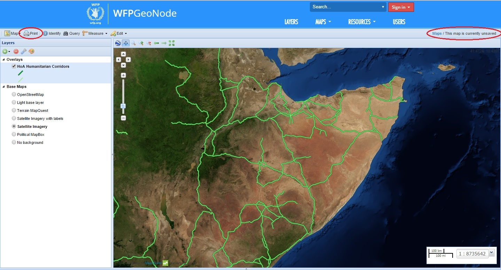

.. _basic_user_module:

=================
Basic User Module
=================

Module Objectives
=================

Upon completion of the Basic User Module, the participant is expected to be able to:
 
* Navigate WFPGeoNode independently to find data layers and maps by using different routes, filters and search functions; 

* Find and understand detailed information of data layers or maps, such as metadata, ownership and usage; 

* Download data layers from WFPGeoNode in different file formats; 

* Produce maps using already existent layers, as well as save and print maps. 

The main goal of the Basic User Module is to let users familiarize themselves with WFPGeoNode and practice basic skills in preparation for the following advanced module. To make the Basic User Module accessible to everyone, it is designed so that unregistered users can follow the training without having to request a user account. 

Basic Level
===========

The following sections will explain how to find maps and layers already published by other users, how to download layers, and how to create maps with existing layers. The division of the sections is based on a specific interface indicated in italics (such as Homepage or Map Composer) or on specific functions indicated in bold (how to **Explore Layers**, or how to **Create a map**). 

Homepage
,,,,,,,,,

The WFPGeoNode Homepage (Figure 1) offers a few options to start navigating the system. There are four main links at the top of the homepage: **Layers, Maps, Documents,** and **Users**. These links are permanent, allowing you to easily navigate between different interfaces without necessarily returning to the homepage. There are also three useful quick-links at the bottom of the page: **Explore Data, Explore Maps** and **Upload Data.**

.. image:: img/Geonode_Homepage.jpg
*Figure 1: WFPGeoNode Homepage with quick links*

Explore maps 
,,,,,,,,,,,,

Two different maps can be stored and accessed in WFP GeoNode: interactive maps and static maps (e.g. pdf, jpg and png). To access both types of maps stored in WFP GeoNode use the quick-link **Explore Maps** at the bottom of the homepage, or **Maps** in the permanent link section. Specific maps can be found by typing in the **Search**-field (e.g. a country name or thematic area) at the top of the homepage.

Following either of these methods to access maps, a list of results will appear (Figure 2) sorted according to when the data was shared (**Most recent** and **Less recent**) as well as alphabetically (A-Z and Z-A) or by order of importance (**Most Popular** and **Relevance**). The results can be filtered according to Categories, **Date** and **Keywords** by using the left-side panel. To view only either interactive maps or static maps use **Maps** in the permanent link section to filter the maps according to type (**Interactive Maps** or **Static maps**) in the drop-down box.

.. image:: img/Geonode_Explore_Page1.jpg  
*Figure 2: Explore maps interface with filters*

.. TIP::
    Both maps and data layers will appear in the result list after performing a search. You can quickly distinguish between maps and layers by looking at the buttons on the right side; maps will have a View button, while data layers will have a Create a map button. 

Access static maps
,,,,,,,,,,,,,,,,,,

WFPGeoNode allows users to link static maps with layers, interactive maps and documents in order to interconnect relevant information. To visualize specific static maps and their associated layers/maps click on the title of the map. Once the static map is visible *(Figure 3)*, it is possible to save it in your file system by using the right-click function of the mouse and saving it as an image. 

*Figure 3: Static map - access detailed information*

Access interactive maps
,,,,,,,,,,,,,,,,,,,,,,,

To visualize and access all detailed information about an interactive map, enter the Map View interface by clicking on the title. It is then possible to pan the map by holding down the mouse button and moving the cursor, or by using the arrows and zoom tools on the left side of the map *(Figure 4)*.

In the *Map View* interface there is also a tab section below the map where you can view more **Info** about the map such as all the metadata, **Share** the map through social media, use the **Ratings** and leave **Comments**. On the right side under **Map Layers** there is a list of the data layers used for composing the map. At the top of the page, use **Download Map** to extract all the data layers used for composing the map and save it on your computer.

*Figure 4: Interactive map view with different functions*

Map composer and tools for map management
,,,,,,,,,,,,,,,,,,,,,,,,,,,,,,,,,,,,,,,,,

By clicking **View Map** in the Map View interface a larger version of the map will appear in the Map Composer interface, as well as tools for changing the map and a list of layers used for that specific map *(Figure 5)*.
space here on online doc

*Figure 5: Map composer interface with map management tools*

The toolbar just above the map is used to easily navigate between different extents and scales (Figure 6). WFPGeoNode also allows the user to view a map in Google Earth with an embedded Google Earth Viewer. You will need to install the Google Earth plugin, which is available for download at Google’s website, or here: http://www.google.com/earth/explore/products/plugin.html. 

*figure 6: Toolbar for map navigation*

The toolbar on the top-left side is used for editing and managing the map *(Figure 7)*. Here you may: 

* **Save** or Publish the map on a website by using **Map** (only for registered users), 
* **Print** the map by saving it in pdf-file format, 
* View feature attributes on a selected location on the map by using **Identify**, 
* View attribute table of a selected layer and search for specific values by using **Query**, 
* **Measure** a specific length or area on the map, and 
* **Edit** the value of selected features (depending on permissions). 

.. image:: img/Toolbar_for_map_editing1.jpg 
*Figure 7: Toolbar for map editing*

To measure the distance or area between specific points on a map use the **Measure** symbol and click on the first location. A pop-up window indicates the distance in kilometers, and additional distances can be measured by clicking on more locations. To calculate the final distance, double-click on the last location. In *(Figure 8)* the approximate length of a road between two warehouses have been measured and the distance in kilometers is visible.

*Figure 8: Measure distance between two locations on a map*

You will find various pre-set **Base Maps** in the panel on
the left side of the page *(Figure 9)*, which can be altered
depending on how you would like the base layer to be
displayed.

The **Overlays** are the layers used for composing the
map. By ticking the box on the left side of a layer title
you can turn it on, or off, in order to either display it, or
hide it, on the map. The layers are displayed on the map
according to their order in the panel list, where layers
on top have visual precedence in ascending order. To
change the display order of the layers, simply drag-anddrop
them up or down.

The toolbar symbols at the top allow you to **Add** or
**Remove Layers**, and change **Layer Properties**. The
**Style palette** symbol is only active if a user with the right
permissions has signed in.

.. TIP::
	To view detailed information of a specific layer, right-click on the layer in the panel and choose **Layer Info**. A new tab in the web browser with all the information of the layer will open without the user having to exit the *Map Composer* interface.

.. image:: img/Layers_section_and_toolbar.jpg
*Figure 9: Layers sections and toolbar*

With **Layer Properties** it is possible to adjust and save the display of that layer in the Map Composer without actually changing the original style of the layer. This function is useful if e.g. you do not have permissions to save or edit a layer but still would like to modify the appearance of a layer for a specific map you are creating.

To use **Layer Properties** select the layer and click on the wrench symbol in the toolbar. Under the tab **About**, you can provide a title for the display of the layer as well as a description. Under the **Display** tab you can modify the transparency of a layer by defining the **Opacity** percentage, as well as constrain certain aspects of the layer by using **Limit with filters** and **Limit by scale**. In *Figure 10* the transparency of the roads has been reduced in half compared to *Figure 5*, and the **About** tab has been selected.

*Figure 10: Layer Properties - About Tab*

.. TIP::
	The metadata of the original layer will remain the same even if you change the title or description of the layer in Layer Properties. However, if you are a registered user, by clicking the Map -> Save symbol you can save a particular display of the layers defined under Layer Properties, either to the existing map or by saving a new copy of the map.

Explore Data Layers
,,,,,,,,,,,,,,,,,,,,

To find the data layers stored in WFPGeoNode you can use the quick-link **Explore Data** at the bottom
of the homepage, or the link **Layer** in the permanent tab section. It is also possible to **Search** for data
layers using the search-field.

View Data Layers
,,,,,,,,,,,,,,,,,

Click on the title of the data layer to visualize the layer and access more detailed information. The
interface *(Figure 11)* is very similar to the map interface, including the navigation toolbar and information
about the owner.

.. image:: img/View_data_layer.jpg
*Figure 11: View data layer*

There is an additional tab in the tab section below the map for all the **Attributes** associated with the layer. In addition, on the right side the **Legend** is visible after a style has been associated with the layer; under the **Maps using this Layer** it is possible to quickly navigate to the maps where the layer is being applied; and by using **Create a map** the current layer will automatically appear in a map for continous map creation.

It is possible to extract the data of a vector layer in different file formats (KML, GeoJson, Excel, CSV or Zipped Shapefile) as well as the data of a raster layer (GeoTIFF, ArcGrid, KML, PNG or JPEG), by using the blue button Download Layer at the top right corner. This is useful in case you would like to send data, or need to use data offline with other GIS software such as QGIS or ArcGIS.

Create a Map
,,,,,,,,,,,,

WFPGeoNode allows you to easily create a map using layers already saved into the platform. You can choose between two simple procedures to create a map this way:

	1. Find the data layer you would like to use for the map either through a search or by clicking on Layers, and then use the red button 		**Create a map** ((In *Figure 12* the data layer containing humanitarian corridors in the Horn of Africa is selected). Your chosen layer will 		automatically appear in a new map and as an overlay in the side panel.

*Figure 12: Create a map by starting with a search*

	2. You can also use the permanent link **Maps** and click on the red button **Create a New Map** in the topright
	corner. No layer will appear automatically, instead you have to choose layer by clicking the button
	**Add Layers -> Add layers** *(Figure 13a)*. Ensure **My GeoServer WMS** is selected in the drop-down box
	at the top of the panel, then select your layers and click **Add Layers** at the bottom *(Figure 13b)*. When you
	have added all your selected layers click **Done** and your layer will appear in the map and as an overlay
	in the side panel.

.. image:: img/Add_layers_symbol.jpg
*Figure 13a: Add Layers Symbol*

 .. image:: img/Select_and_add_layers.jpg
*Figure 13b: Select and add layers*

In *Figure 14*, the layer of humanitarian corridors in the Horn of Africa is visible. Another layer displaying the location of WFP warehouses has been added using the **Add Layer** function. As you can see in the top-right corner this map is not saved, and unless you sign in with a user account you will not be able to save it on WFPGeoNode. However you can save your map as a pdf file on your computer by using the **Print** button in the toolbar for map editing.

*Figure 14: Unsaved map of HoA with print funtion marked*

By clicking Print, a pop-up window will appear where
you can set the zoom level, the paper-size and the
resolution of the map. You can define a title for your
map and provide additional information regarding the
data included in the map. By clicking the Print button
your map will be saved in your file system to be printed
at your convenience (*Figure 15*).

.. image:: img/Print_preview_for_HoA_map.jpg
*Figure 15: Print preview for HoA map*

.. TIP::
	If you are experiencing difficulties in saving your map as a pdf file in Windows Explorer ensure your security permissions in the browser are configured properly.

Explore Documents
,,,,,,,,,,,,,,,,,,

WFPGeoNode allows users to upload documents and link these to existing layers or maps in order to connect additional relevant information. The permanent link **Documents** takes you to the *Explore Documents* interface where all existing documents in the system can be found (*Figure 16*).

*Figure 16: Explore documents interface*

Access the document to view more detailed information and navigate to its linked layers and maps *(Figure 17)*.

*Figure 17: View document and find linked layers/maps*

Basic User
===========

The purpose of the exercise is to practice two different ways of creating a map using already existing layers. The participant will practice using some basic functions, such as finding specific layers, navigating different routes and creating a simple map.

The map will visualize the results of an analysis of cyclone trends in Myanmar, which was performed by counting the number of cyclones passing through certain townships in 1968 – 2009. These types of historical trends are useful when trying to understand the likelihood of events as well as to identify the most disaster-prone areas.

The output of the exercise will consist of a map using already styled layers. In the next module, the participant will practice how to upload and style layers from the beginning.

Layers Used
,,,,,,,,,,,,

• Myanmar capitals
• Myanmar cyclone tracks 1968-2008
• Myanmar number of cyclones 1968 – 2008
• Myanmar Cloud Free Earth (1km)

Exercise
,,,,,,,,,

1. Ensure that all layers above are available
on WFPGeoNode by performing a simple
search in the **Search-field** (*Figure 18*).

2. Click on **Maps**, and then click on **Create a New
Map**. As you can see there are no layers in
the Overlays section.

.. image:: img/Search_for_myanmar_layers.jpg
*Figure 18: Search for Myanmar layers*

3. Click on the green button **Add Layers**. Choose **Add
layers**. Make sure the correct server is selected (**My
GeoServer WMS**) and add all the four layers. Click
**Done** (*Figure 19*).

.. image:: img/Add_myanmar_layers.jpg
*Figure 19: Add Myanmar Layers*

4. All the layers should now be displayed on the map.
Drag-and-drop the layers in the same order as they are
mentioned above so that the map looks like *Figure 20*.

5. Experiment with the display of the layers by ticking the
boxes of the titles to hide or show layers.

*Figure 20: Map of cyclone trends in Myanmar*

Now try an alternative route of creating the map, with the starting point of a layer:

1. Type in Myanmar in the **Search**-field and click on the
layer “Myanmar Cloud Free Earth (1km)” in the dropdown
select box (*Figure 21*).

*Figure 21: Search performed on Myanmar*

2. Scroll down and click **Create a Map** on the right side
(*Figure 22*).

.. image:: img/Create_a_map_from_the_layer_view.jpg
*Figure 22: Create a map from the layer view*

3. The *Map Composer* interface will appear with your layer already visible on the map (*Figure 23* ). Under the Overlays section you will find your layer, and from here you can start adding the other three
layers as described above.

.. image:: img/Myanmar_cloud_free_earth_1km_layer_added.jpg
*Figure 23: “Myanmar Cloud Free Earth 1 km” layer added*

4. When you have added all layers, ensure all layer boxes are checked and that the display order is correct before clicking the **Print** button.
Set an appropriate zoom level, resolution and paper size. Give you map the title “Myanmar Historical Cyclone Trends 1968 –2008” and provide some explanatory comments before you click **Print** to save the map as a pdf file (*Figure 24*).

.. image:: img/Print_preview_for_myanmar_map.jpg
*Figure 24: Print preview for Myanmar map*

